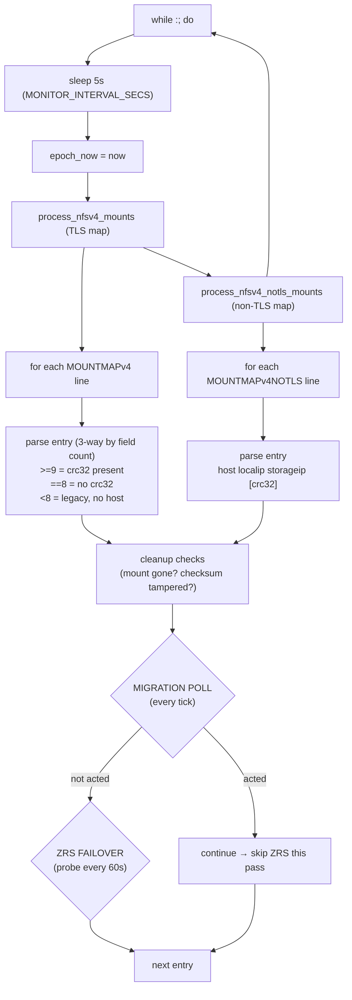
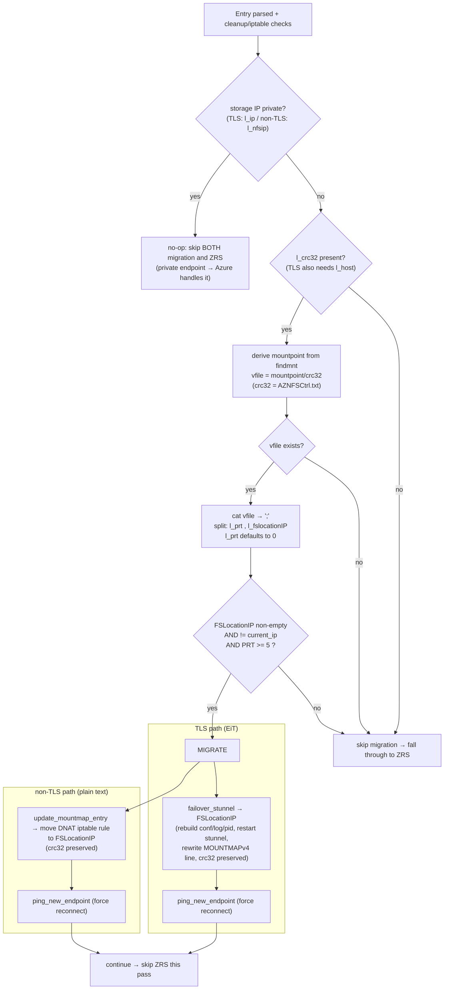

# NFSv4 Watchdog — Account Migration Polling vs ZRS Failover

`aznfswatchdogv4` supports **two independent failover mechanisms that are active at all
times** and never depend on each other:

| Mechanism | Trigger | Detection | New IP source | Action |
|---|---|---|---|---|
| **Account migration** | Server-signalled | Poll virtual file every 5s | `FSLocationIP` from the crc32 virtual file | swap to new IP |
| **ZRS zone failover** | Client-detected | Conntrack (5s) + TCP probe (60s) | DNS re-resolve (`resolve_ipv4`) | swap to healthy IP |

On each entry, the **migration poll runs first**; if it acts it `continue`s and skips ZRS for
that pass (the server signal is authoritative). The `crc32` field is preserved through a ZRS
failover, so migration keeps working afterward — and migration preserves everything ZRS needs.

**Private endpoints (VNet) are a no-op for BOTH mechanisms.** Azure handles failover internally
and the endpoint IP is stable, so neither ZRS probing nor migration polling runs for a private
storage IP. (TLS keys off `l_ip`; non-TLS keys off `l_nfsip`, since its `l_ip` is the local DNAT
proxy and always private.)

The diagrams below are [Mermaid](https://mermaid.js.org/); GitHub and VS Code render them inline.

## 1. The pulse: one watchdog tick

Every `MONITOR_INTERVAL_SECS = 5s` the loop wakes and walks each mountmap entry.
Migration is checked **first, every tick**; ZRS probing is gated to every `HEALTH_CHECK_FREQUENCY = 60s`.



## 2. Migration poll decision (per entry, every 5s)



## 3. Server-driven migration over successive ticks (sequence)

The guard is `PRT >= 5` (migration cutover stage): PRT 1-4 are prep stages and are ignored;
only PRT >= 5 with a changed `FSLocationIP` triggers the swap.

```mermaid
sequenceDiagram
    autonumber
    participant SRV as Storage server
    participant VF as Virtual file<br/>mountpoint/AZNFSCtrl.txt<hash>
    participant WD as aznfswatchdogv4<br/>(5s pulse)
    participant MM as MOUNTMAP + DNAT/stunnel

    Note over SRV,VF: Steady state
    SRV->>VF: "0;" (PRT=0, no new IP)
    loop every 5s
        WD->>VF: cat vfile
        VF-->>WD: "0;"
        WD->>WD: guard fails (PRT<5) → skip, do ZRS
    end

    Note over SRV: Migration begins (cutover)
    SRV->>VF: "5;10.2.0.9" (PRT=5, FSLocationIP set)
    WD->>VF: cat vfile (next tick, <=5s later)
    VF-->>WD: "5;10.2.0.9"
    WD->>WD: guard passes (PRT>=5 & IP changed)
    WD->>MM: TLS: failover_stunnel → 10.2.0.9<br/>non-TLS: update_mountmap_entry (DNAT)
    WD->>MM: ping_new_endpoint (RST → client reconnect)
    WD->>WD: continue (skip ZRS this pass)

    Note over WD: Subsequent ticks are idempotent
    WD->>VF: cat vfile
    VF-->>WD: "5;10.2.0.9"
    WD->>WD: FSLocationIP == current_ip now → guard fails → no-op
```

## Migration trigger guard

The guard (both TLS and non-TLS) is:

```
[ -n FSLocationIP  -a  FSLocationIP != current_ip  -a  PRT -ge 5 ]
```

| PRT value | Behavior |
|---|---|
| 0 | not migrating — ignored |
| 1-4 | prep stages — ignored (do NOT move yet) |
| >= 5 | cutover — migrate to FSLocationIP |

Poll cadence (every 5s) and idempotency are independent of the threshold.

## Mountmap schema (crc32 = trailing field)

- **TLS `MOUNTMAPv4`**: `host;ip;conf;log;pid;checksum;status;timeout;crc32` (9 fields).
  Parsed 3-way for backward compat: `>=9` with crc32, `==8` without, `<8` legacy (no hostname).
- **Non-TLS `MOUNTMAPv4NOTLS`**: `host localip storageip crc32` (4 fields; legacy 3-field tolerated).

`crc32 = get_aznfs_ctrl_filename(hostname)` → `AZNFSCtrl.txt<decimal>`, the deterministic name of
the server's control/virtual file at the share root.
