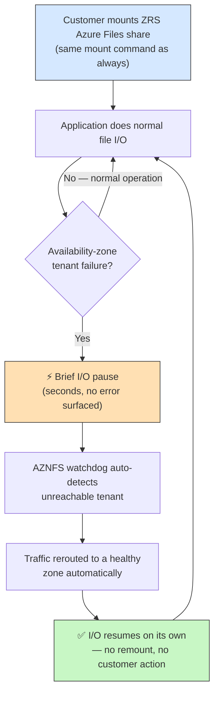
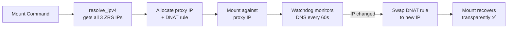
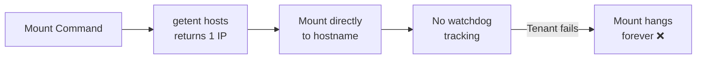
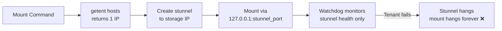
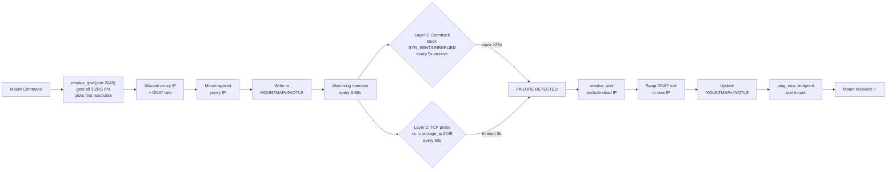
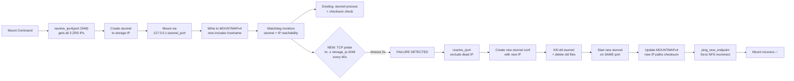
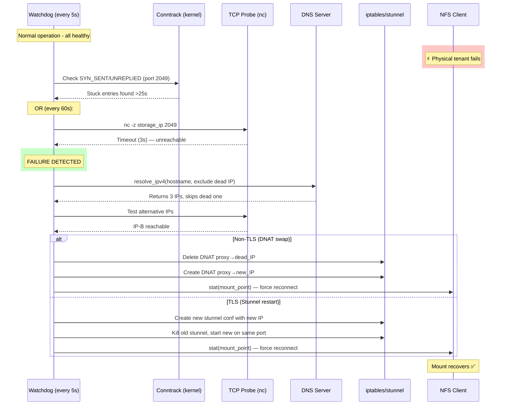

# NFSv4 ZRS Failover — Overview & Changes

## Problem Statement

Azure Files ZRS (Zone Redundant Storage) accounts have 3 physical tenants across availability zones, each with its own IP address returned by DNS. For NFSv3, AZNFS already handles failover automatically — when DNS routing changes (e.g., due to a zone failure), the watchdog detects the IP change and transparently updates the DNAT rule so the mount reconnects to a healthy tenant. **For NFSv4, no such failover existed.** If a physical tenant failed, the mount hung indefinitely, wasting the 2 available backup tenants.

## Customer Perspective

From the customer's point of view, **nothing changes in how they mount, and nothing new is required of them.** The failover is fully automatic, zero-configuration, and transparent to the application.

### What the customer experiences



### Before vs after — the customer-visible difference

| Aspect | Before (no NFSv4 failover) | After (this change) |
|--------|----------------------------|---------------------|
| Zone/tenant failure on a ZRS share | Mount **hangs indefinitely**; app I/O stalls until manual remount | Mount **self-heals**; I/O resumes automatically |
| Customer action required | Manual intervention (unmount/remount, possibly reboot) | **None** — fully automatic |
| Mount command / configuration | — | **Unchanged** — no new flags or setup |
| Recovery time | Never (until manual fix) | **~60 seconds** (typical) |
| Applies to | — | NFSv4 **TLS and non-TLS**, public endpoints only |

### What customers should know

- **No opt-in needed.** Failover is handled by the AZNFS watchdog that already runs for every mount. Just keep the AZNFS package up to date.
- **Only affects public-endpoint ZRS accounts.** Private endpoints are intentionally skipped — Azure's networking handles private-endpoint resiliency internally, so AZNFS treats them as a no-op (no behavior change, no risk).
- **Non-ZRS (LRS/GRS) accounts are unaffected.** DNS returns a single IP, so the failover logic simply no-ops.
- **Brief pause, not an error.** During the ~60s detection window the app may see I/O block momentarily; it is not returned an error, and it resumes once traffic is rerouted.

## Before: NFSv3 vs NFSv4

### NFSv3 — Working Failover



### NFSv4 Non-TLS — No Failover



### NFSv4 TLS — No Failover



## After: NFSv4 ZRS Failover

### NFSv4 Non-TLS — Fixed



### NFSv4 TLS — Fixed



## Detection Flow



## What Changed — Summary

### Files Modified

| File | Changes |
|------|---------|
| `lib/common.sh` | Added `MOUNTMAPv4NOTLS`, generic mountmap functions, moved IP allocation helpers, parameterized `resolve_ipv4` with `probe_port` and `exclude_ip` |
| `src/nfsv4mountscript.sh` | Non-TLS: proxy IP + DNAT + MOUNTMAPv4NOTLS. TLS: hostname in MOUNTMAPv4, `resolve_ipv4` with port 2049 |
| `src/nfsv3mountscript.sh` | Functions moved to common.sh, `$MOUNTMAP_WRITE_FN` for parameterized writes |
| `src/aznfswatchdogv4` | Conntrack monitoring (port 2049), TCP probe, `process_nfsv4_notls_mounts()`, `failover_stunnel()`, TLS failover detection, `ping_new_endpoint()` |
| `packaging/aznfs/DEBIAN/postrm` | Cleanup for `mountmapv4notls` |
| `packaging/aznfs/RPM/aznfs.spec` | Cleanup for `mountmapv4notls` |

### New Files

| File | Purpose |
|------|---------|
| `/opt/microsoft/aznfs/data/mountmapv4notls` | Tracks non-TLS NFSv4 mounts: `hostname localip storageip` |
| `testing/simulate_zrs_failover.sh` | Test script: blocks storage IP to simulate zone failure |
| `docs/nfsv4-zrs-failover-plan.md` | Detailed implementation plan |

### Key Design Decisions

1. **Non-TLS uses DNAT** (same as NFSv3) — proxy IP allocated, iptables redirects traffic, watchdog swaps DNAT on failure
2. **TLS uses stunnel restart** — new conf/log/pid files created with new IP, stunnel restarted on same port, NFS client reconnects transparently
3. **Failure-based trigger** (not DNS-change-based) — NFSv4 is stateful, swapping on every DNS rotation would break connections. Only swap when current IP is confirmed unreachable.
4. **Private endpoints excluded** — `is_private_ip()` gate ensures failover only runs for public endpoints (Azure networking handles private endpoint failover internally)
5. **Separate mountmap file** (`mountmapv4notls`) for non-TLS — avoids mixing with TLS semicolon-delimited entries in `mountmapv4`

## Timing, Detection vs. Recovery, and Pacemaker Guidance

**Important distinction:** the `60s` figure is the *detection cadence*, **not** the total client-visible failover time. Plan HA timeouts against the worst-case end-to-end recovery, not the probe interval.

### Two-layer detection

| Layer | Mechanism | Cadence | Tunable |
|-------|-----------|---------|---------|
| L1 — Conntrack (passive) | Kernel `conntrack` scan for stuck `SYN_SENT`/`UNREPLIED` entries to port 2049 | every **5s** (`MONITOR_INTERVAL_SECS`) | not currently exposed |
| L2 — Active TCP probe | `nc -w 3 -z <storage_ip> 2049` (single SYN, 3s timeout) | every **60s** (`HEALTH_CHECK_FREQUENCY`) | **`AZNFS_HEALTH_CHECK_FREQUENCY`** |

L1 depends on kernel conntrack/TCP retransmit timing (only fires once an entry is actually stuck). L2 is independent of the mount's TCP stack.

### End-to-end client-visible failover budget

```
total ≈ detection latency  +  recovery actions  +  NFS client reconnect
```

| Phase | Typical cost |
|-------|--------------|
| Detection latency (L2) | **0–60s** (depends where in the probe cycle the failure lands) + up to 3s probe timeout |
| Detection latency (L1, stuck-SYN case) | ~5s cycles, but gated by kernel conntrack/TCP retransmit timing |
| Recovery — non-TLS | DNAT swap, **sub-second** |
| Recovery — TLS | stunnel kill + restart, **~1–3s** |
| NFS client reconnect | TCP re-handshake + NFS retransmit, governed by mount `timeo`/`retrans` |

**Worst case can exceed 60s** (≈ up to 60s detection + a few seconds recovery + client reconnect).

### Pacemaker / clustered-HA guidance

Azure's published Pacemaker guidance often uses a **60s** monitor/timeout for the storage resource. Because *detection alone* can take up to ~60s here, a failure landing early in the probe window plus recovery can overrun a 60s monitor and trigger an unnecessary fence/failover. Recommended options:

1. **Raise the Pacemaker resource monitor timeout** to cover worst case — e.g. `timeout ≥ 120s` (safest, no AZNFS change needed).
2. **Shorten AZNFS detection** by lowering the probe cadence. Create `/opt/microsoft/aznfs/data/config` with, for example:
   ```
   AZNFS_HEALTH_CHECK_FREQUENCY=15
   ```
   then `systemctl restart aznfswatchdogv4`. This reduces worst-case detection from ~60s to ~15s. (The watchdog unit reads this file via an optional `EnvironmentFile`; the default remains 60s if the file is absent.)
3. **Combine both** — a lower probe cadence *and* a monitor timeout with headroom.

> Trade-off: a lower `AZNFS_HEALTH_CHECK_FREQUENCY` means more frequent `nc` probes per mount. The cost is one lightweight SYN per mount per interval; keep it in the 10–20s range rather than very low single-digit values.

## Testing Method

### Simulation Approach
Since we cannot trigger an actual Azure zone failover on demand, we simulate it by blocking traffic to the current storage IP using iptables DROP rules. This makes the storage IP completely unreachable (silent packet loss), which is identical to what happens when a physical tenant fails.

### Test Steps

1. **Mount** the ZRS storage account (verify 3 DNS IPs, proxy IP/stunnel setup, mountmap entry)
2. **Start I/O loop** (`ls` every 2 seconds) to see the interruption in real time
3. **Block the storage IP**: `iptables -I OUTPUT -p tcp -d <storage_ip> --dport 2049 -j DROP`
4. **Observe** the watchdog logs for failure detection and failover
5. **Verify** mountmap updated with new IP, DNAT/stunnel updated, I/O loop resumes
6. **Unblock** the old IP

### Results

| Scenario | Detection Time | Recovery |
|----------|---------------|----------|
| Non-TLS failover | ~60s (TCP probe) | DNAT swapped, mount recovered, I/O resumed |
| TLS failover | ~60s (TCP probe) | Stunnel restarted with new IP, new files created, mount recovered |

### What the Logs Show

```
Storage IP 52.239.239.8 is unreachable on port 2049 for daniewozrs5.file.core.windows.net
Failure detected for daniewozrs5.file.core.windows.net [... -> 52.239.239.8], attempting failover...
IP for daniewozrs5.file.core.windows.net changed [52.239.239.8 -> 52.239.239.40], updating DNAT.
Failover complete for daniewozrs5.file.core.windows.net [52.239.239.8 -> 52.239.239.40]
```
